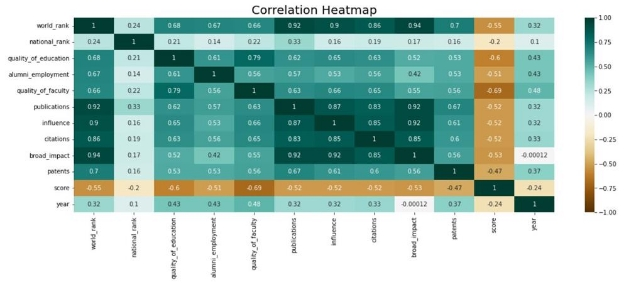
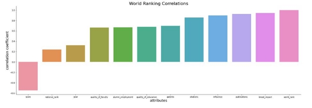
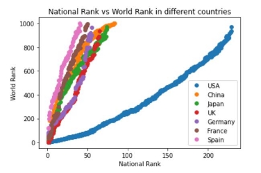
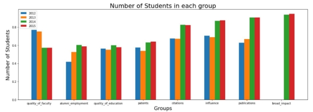
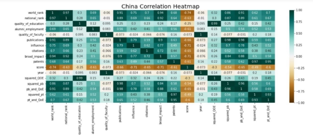

**Factors that Affect World University Rankings 

About us:**

Aanisha Newaz: <https://github.com/Aanisha02>

Jessica Patel: <https://github.com/JessicaPatel711>

Islam Nuryyev: <https://github.com/IslamNuryyev>

Japnit Ahuja: <https://github.com/japnitahuja>

**Introduction:**

As university students, we all have done extensive research on which post secondary institute to attend to further our education. While choosing a university, some may look for the best faculties for their career and university experience, the top school with a great reputation nationwide, or an institute with a high rate of employment success. Some may even have a reason as simple as living close to their university. Nonetheless, researching about faculties and universities has become an interesting experience for most students.

This is the mindset we’ve established once we found an interesting dataset to look more into, named World University Rankings, which was collected by Myles O'Neill and published on www.kaggle.com. This data set is a university ranking list formed from various sources, including the Science Citation Index Expanded, Social Sciences Citation Index, and the Arts & Humanities Citation Index. These indexes were used to help sort universities by their ranking and had a score for attributes and factors which may be linked to their ranking. Some attributes that were investigated are:

- National ranking – The rank of university within its country
- Quality of education – The rank for quality of education
- Quality of faculty – The rank for quality of faculty
- Publications – The rank for publications
- Influence – The rank for influence
- Citations – The Number of students at the university
- Broad impact – The rank for broad impact
- Patents – The rank for patents

Finding out which attributes affect an institute’s world rank was done by constructing various visual graphs and data frames to help answer the major question - what affects the world university rankings and how does it change throughout the years? Are there any attributes that correlate to the world ranking and if there are, how are they correlated?

**Discussion:**

Seeking an answer lead us to finding out both expected and unexpected results. Our initial goal was to learn about the general ranking system, and how each factor affected one another. The World University Dataset looks at a total of 1024 universities from 59 different countries, the top three countries with the most ranked universities being the United States, China, and Japan. With the use of ten unique attributes, the primary objective to help us reach a conclusion was to find out what kind of relationship each attribute had with the world ranking of the institute and one another. As a solution, we constructed a correlation heatmap to aid us with getting results, looking for positive correlations (closer to 1 or cooler hue), negative correlations (closer to -1 or warmer hue) or a weak correlation (low saturated areas).

We found three attributes with strong positive correlations to the world ranks – broad impact, publications, and influence.

One would expect the national rank to have a high correlation with the world rank. However, based on the above chart this was not the case as the correlation coefficient was 0.24, which seemed unusual.  Thus upon further analysis of the data we discovered that to get the true correlation between the two we would require to compare the national ranking of a specific country to the world ranking of the universities of that country. Comparing all the national rankings and world rankings wasn’t an accurate way to calculate the correlation.

Based on the graph, as we compare the world rankings and national rankings of each country, the relationship between them is positive and all have a linear line of best fit. This concludes that if a university has high national ranking it would have a higher world ranking as well, as expected.

We then tried analysing the correlation between the features and the world ranking in relation to the country and the year.

Using the graph displayed above, we found that for 2012 and 2013, the top three correlated features were quality of faculty, citations and influence. This however did not reflect onto the data for 2014 and 2015, as the top three for those years were broad impact, publications and influence. This illustrates that an institution's ranking can be better predicted by their impact and influence in the academic world in terms of research and other avenues in 2014 and 2015 compared to 2012 and 2013, where the faculty and number of students were more important.

Interesting trends to note are how the correlation of quality of faculty - which was one of the top three features in 2012 and 2013 - decreases over the years. This stood out to us since the correlation between all other features with the world ranking kept getting stronger over the years. This chart helped us look further into how different attributes affected the world ranking depending on the year, and this can be illustrated by noticing the effect of quality of faculty declining over the years.

To find the attributes correlation and university ranking trend based on countries, we chose the top three of most ranked countries to study - the USA, China and Japan. Three unique heatmaps were constructed, one for each country to illustrate their universities’ ranking. An interesting observation that was found was China’s correlation heatmap and how China’s priority to university attributes did not follow the global trend. The quality of faculty had moderate to high positive correlation with other features for the global trend, but for China this feature showed low correlation with all other features.

Once we discovered the yearly and national trends of the university rankings, we decided to observe how the ranking of the top country varies over time depending on governmental educational policies/reforms. Since the United States of America is the country with the most number of universities ranked we decided to analyze its top three ranked universities. The top three American universities were also at the top of the list for world ranking.  For the year 2012 the top 3 universities for USA are also the top three in the world which are Harvard University with an international ranking of 1, Massachusetts Institute of Technology placing second, and Stanford University placing third.  This was the year that America had a 400 million dollar expansion for the Race To The Top program. The amount of money the American government spends to keep students in school and the amount of money universities spend on their students could be one of the reasons why America is the country with the most top universities.  The year 2013 was the year that Stanford university placed second internationally and nationally leaving Massachusetts Institute of Technology to place third. The reason Stanford was able to place second is because it had a greater influence and more popularity that year because 11 of the 100 most-influential educational scholars were from the Stanford Graduate School. From previous analysis we know that influence, publications and citations have a great influence on determining the university rankings. Therefore, the reason Stanford ranked higher than MIT is because it ranked higher in many other attributes that have a high correlation with the world ranking. The year 2014 was the year that America implemented the Common Core State Standards initiative however not much had changed for universities which is why the rankings are the same.

Harvard ranks highest in all attributes which is why it is the top-ranked university. We can see that Stanford ranks lower than MIT in some attributes but the ones that correlate strongly to the world ranking Stanford ranks higher than MIT. We can observe the same trend as 2013-2014 in 2015.

**Conclusion:**

Although the interest in this topic led us to studying this dataset, we were met with obstacles along with the knowledge. This report discussed the correlation between various attributes and factors that make education better with the world university ranking system. To reach the goal of understanding the trends of university education and institution ranking, we focused on the relations between different attributes with world rank, mainly how they change yearly and through one nation to another. This was done by constructing hue charts to see how different the world rank’s relation with different attributes rise and fall depending on the year. To view countrywide trends on university ranking, additional heatmaps were constructed, to which we discovered China's unique trend that did not follow the other top countries. Following this finding, we investigate why certain attributes have a stronger correlation to the world ranking than one another based on the year. This was done through external research, where we looked for reasons and factors to why certain universities were chosen to be in the top three, and for this research, we picked the United States. Through thorough research, we have concluded that broad impact, influence, and publications have a high correlation with world ranking and have the  greatest influence when rolling out world university rankings. We successfully constructed graphs to display how they change throughout the years to better understand the yearly trends.

**Citations:**

Troyer, M. (2019, November 18). *25 ways American education has changed in the last decade*. Stacker. Retrieved December 5, 2021, from <https://stacker.com/stories/3665/25-ways-american-education-has-changed-last-decade?page=3>.

Rabinovitz, J., & Rabinovitz, J. (2013, January 14). *Stanford renames education school to emphasize its graduate research, Education*. Stanford University. Retrieved December 5, 2021, from <https://news.stanford.edu/news/2013/january/education-name-change-011413.html>.

*A look at how American legislation has changed education in the last 15 years: Resilient educator*. ResilientEducator.com. (2020, March 10). Retrieved December 5, 2021, from [https://resilienteducator.com/news/a-look-at-how-american-legislation-has-changed-education-in -the-last-15-years/](https://resilienteducator.com/news/a-look-at-how-american-legislation-has-changed-education-in-the-last-15-years/).

*Education policy in the United States*. Ballotpedia. (n.d.). Retrieved December 5, 2021, from <https://ballotpedia.org/Education_policy_in_the_United_States>.
